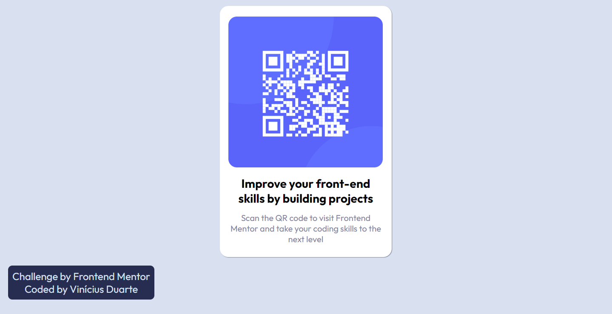

# Frontend Mentor - QR code component solution

This is a solution to the [QR code component challenge on Frontend Mentor](https://www.frontendmentor.io/challenges/qr-code-component-iux_sIO_H). Frontend Mentor challenges help you improve your coding skills by building realistic projects. 

## Table of contents

- [Overview](#overview)
  - [Screenshot](#screenshot)
  - [Links](#links)
- [My process](#my-process)
  - [Built with](#built-with)
  - [What I learned](#what-i-learned)
  - [Continued development](#continued-development)
  - [Useful resources](#useful-resources)
- [Author](#author)

## Overview
  That is the first challenge a take from [QR code component challenge on Frontend Mentor](https://www.frontendmentor.io/challenges). By creating a QR code interface with HTML and CSS.
### Screenshot

### Links

- Solution URL: [GitHub](https://github.com/ViniCellist/Frontend-Mentor-QR-Code-Component-Main)
- Live Site URL: [Vercel](https://frontend-mentor-qr-code-component-main-xi.vercel.app/)

## My process

I started creating the HTML structure: `<main>`, `<section>` and `
`.
Then I used Flexbox to align each item.

### Built with

- Semantic HTML5 markup
- CSS custom properties
  - Flexbox

### What I learned

I used the basic knowledge to create this project, but always good to remember.

### Continued development

In order to become a FullStack Dev, I need to keep practicing.

### Useful resources

- [HTML](https://developer.mozilla.org/en-US/docs/Web) - HTML5 documentation.
- [CSS](https://developer.mozilla.org/pt-BR/docs/Web/CSS) - CSS3 documentation.

## Author

Don't forget following me...

- GitHub - [My personal GitHub](https://github.com/ViniCellist)
- Frontend Mentor - [Frontend Mentor Profile](https://www.frontendmentor.io/profile/ViniCellist)
- Instagram - [Follow me here too!](https://www.instagram.com/vinicius_duartesd/)
- LinkedIn - [If you want to hire me!](https://www.linkedin.com/in/vinicius-de-souza-duarte-57937b192/)
